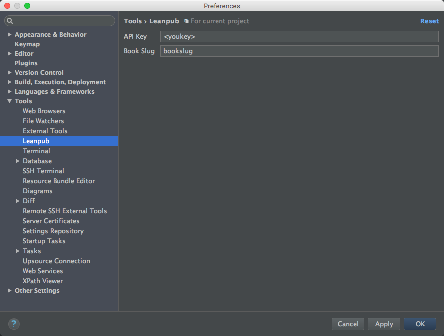
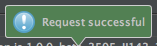
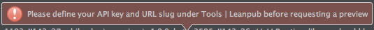

# Leanpub Plugin

Allows requesting preview and publishing of Leanpub books directly from inside
IntelliJ IDEA, WebStorm or other IntelliJ-based IDE's.

## Installation

You can download the plugin from the [Plugin Repository](https://plugins.jetbrains.com/plugin/8167?pr=).

You can also download [latest binary](distro/leanpub-1.0.zip) and install from disk
### Building from source

Download and run 

    gradle build
    
It uses the [Gradle IntelliJ Plugin](https://github.com/JetBrains/gradle-intellij-plugin) to build plugins which does all the heavyweight lifting. Note, this is not the Gradle plugin for IntelliJ IDEA (which already ships with the IDE)
but a Gradle plugin for plugin development. Too many plugins there? It's fine actually. 

## Setup

The plugin requires to configuration parameters:

* API
* Book Slug

The API can be generated from your Author Dashboard on Leanpub. The book slug corresponds to the URL of your book without the
domain name. For instance, if your Leanpub book is at:

    https://leanpub.com/myfirstbook

the slug would be:

    myfirstbook

## Generating previews and publishing 

The plugin installs two menu entries under Tools | Leanpub. The first one generates a complete preview of the book whereas the Publish 
publishes the book. 

If the operation is successful, you'll get notified with a balloon message and shortly afterwards your book will be available in the Dropbox
folder your Leanpub account is linked to. 

If an error occurs, you'll also be notified.

Settings are per project so you can use different API/Slugs for different projects.

### License

Licensed under MIT

(C) Copyright 2016 Hadi Hariri 

